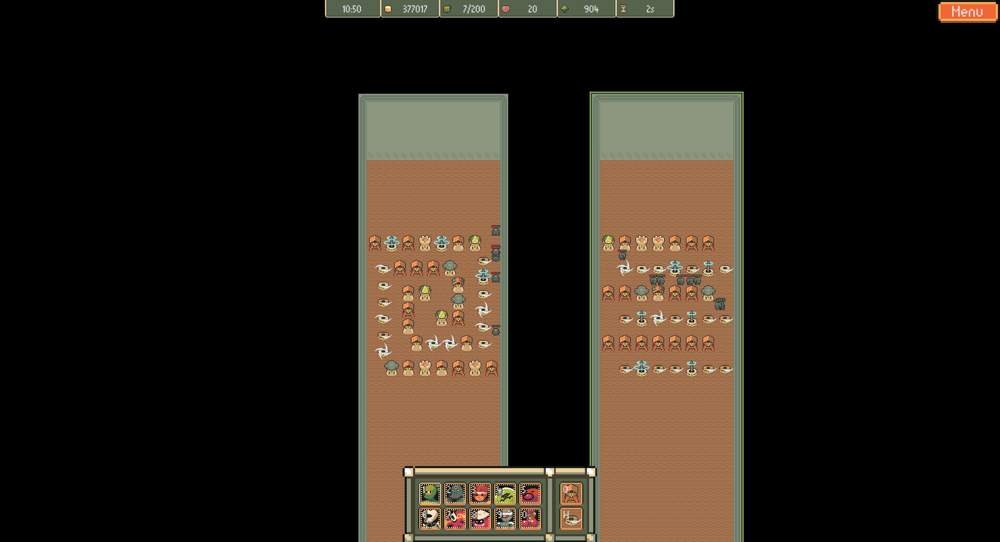

    

# Maze Wars

**Build a maze of towers to protect yourself from enemy units and send units to try to pass through the enemy maze and steal their lives, the last one standing wins.**

:warning: The first **prototype** release of the game will be on Itchio but is still not up :warning:

You can follow development at:

* [GitHub Project](https://github.com/users/xescugc/projects/2/views/1?query=sort%3Aupdated-desc+is%3Aopen)
* [Discord](https://discord.gg/xXcpD3Fjt9)
* [Bluesky](https://bsky.app/profile/yawpgames.bsky.social)
* [Twitter](https://x.com/yawpgames)

For more detailed information you can check the actul Docs and XLS I have in [Drive](https://drive.google.com/drive/folders/1EoIuiOiAEkn-ZRVEdMMFGXV8sq885tnu?usp=sharing)

    

# About the game

I build this game based on a Warcraft 3 mod I use to play on a cybercafe, named [Line Tower Wars](https://www.epicwar.com/maps/159757/).

I have no previous experience on building Games but I wanted to try to build this one as I was not able to find any new version of it
that did not require you to have Warcraft installed.

The game is **UNDER HEAVY DEVELOPMENT** which means that bugs will happen and changes/improvement will be constant, as much as I can on my free time.
At the end this is, for now, a really fun side project that I enjoy working on.

I'm totally open to any type of suggestions about the game.
