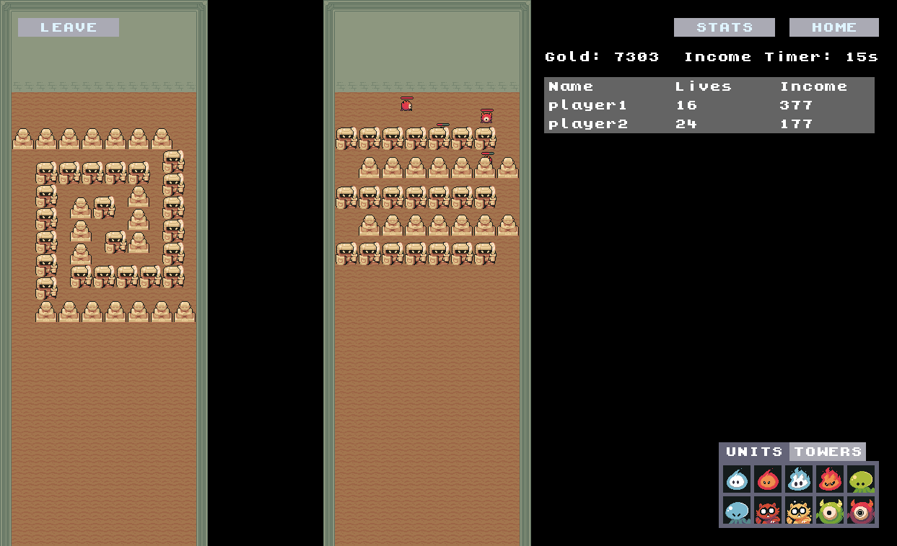

    

# Maze Wars

**Bring your enemies lives to 0 by stealing them with your summoned units passing through their mazes, but be careful, they'll do the same to you!**

To **play** the game go to [maze-wars.com/play](https://maze-wars.com/play) and for **documentation** on how to play the game go to [maze-wars.com/docs](https://maze-wars.com/docs)

    

# About the game

I build this game based on a Warcraft 3 mod I use to play on a cybercafe, named [Line Tower Wars](https://www.epicwar.com/maps/159757/).

I have no previous experience on building Games but I wanted to try to build this one as I was not able to find any new version of it
that did not require you to have Warcraft installed.

The game is **UNDER HEAVY DEVELOPMENT** which means that bugs will happen and changes/improvement will be constant, as much as I can on my free time.
At the end this is, for now, a really fun side project that I enjoy working on.

I'm totally open to any type of suggestions about the game.
